# Concept

This is a battle between two armies. Each player's **castle** contains **20 health points (HP)**.
The player whose castle reaches 0HP loses the game.

Players take turn, playing **Units**, **Skills** and **Buildings** to try and defeat their opponent.

There are 3 **lanes** a player can take to their enemies territory:
The **plains**, the **forest** and the **mountains** (each one is longer, respectively).

Players have **gold** as a resource, which they use to play stuff. Players start the game with 5 gold each.

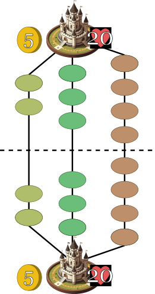

# Units

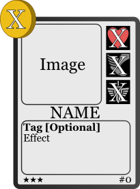

Units are played by paying their gold cost (top left of the card). The units stats are:
-  **Health:** Damage that the unit can take. When it reaches 0, unit dies.
-  **Movement:** How many **tiles** the unit advances when marching.
-  **Attack:** Damage that the unit does to enemy castle or other units when **marching**.

When a unit is played, the player chooses in which **lane** to place it (plains, forest or mountains).
Unit is then placed on the first square of that **lane**.

# March

Units **march** when issued a **marching** command (by the effects of some cards, etc).
When marching, all units from that player (in the order they were played) will move forward by their respective **movement** stats.

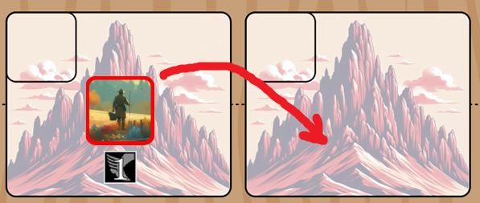

If the **tile** to occupy is already occupied by an enemy unit, the marching unit attacks it.
Both units will receive HP damage simultaneously depending on the enemies attack.

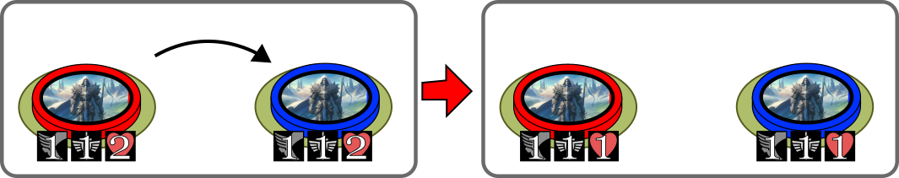

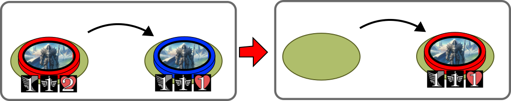

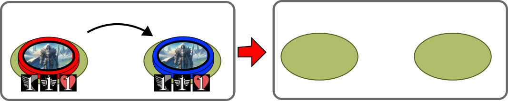

- If the advancing unit kills the opposing enemy while marching, it takes it's space and the unit stops marching.
- Any unit (attacking or defending) that kills a unit grants 2 gold to its owner.
- If unit is in the last **tile** (in front of the opponen's castle) it damages the castle when marching, but doesn't advance further.
- If an enemy unit is in the same **tile** as the marching unit, the marching unit will instead atack it without advancing.
- If multiple defending units are in a **tile**, then they are attacked 1-by-1 in the order they were spawned on the board.
- Units that are tired can't march, tiredness goes away when player's turn is finished.

# Skills

A type of card that casts a spell or skill that affects the board in some way.
Like units, it has a gold cost.
For example, the **RUSH** skill summons **peasants** in every lane and is available every turn for every player (only once per turn).
It is the most basic skill of the game.
Other skill cards can be drawn from the deck and used.

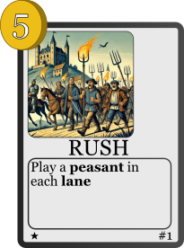
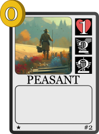

# Buildings

Buildings are a mix between skills and units.
They need to be **constructed** by a unit, and contains a blueprint, which specifies in which **tiles** it can be built.
Once built, the building remains in that **tile** until destroyed.

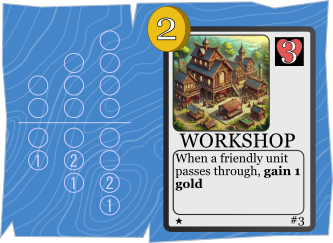

- The player chooses in which **lane** the building will be constructed
- For a building to be built, an unit needs to be present on at least one of the **tiles** indicated in the blueprint
- If there are units in multiple of those possible slots, the building will be placed in the first available number
- The unit that builds the building will be **tired** (can't march until the next turn). **Tired** units can't construct buildings.
- When an enemy passes through a **tile** containing a building, the building receives damage equal to the unit's attack. (The **tile** will still be occupied by the enemy)
- Only one building per **tile** allowed

# Classes

Each player can choose a class (e.g. warrior, mage, astronauts, dinosaurs, whatever).
Each class has different cards with different game styles, but can also use the **base set** "medieval" cards (e.g workshops) allowed to all classes.
- When building a deck, a player has to choose a class, and a deck with a total of 30 cards, using both cards from the class chosen and the **base** cards.
- Card with rarity 1*, 2* and 3* can only have 3, 2, 1 copies in a deck respectively
- Each class also has a passive ability that give them advantages on certain situations or change the style of the class

# Game Structure

When the game begins:
- Each player starts with **4 cards and 5 gold**

Each turn:
- Draw phase: Player **draws a card and gets 2 gold**
- Play phase: Player can use their gold to play units, skills, buildings or the **RUSH** skill (**RUSH** only once per turn)
- End of turn: Player ends their turn, all of the player's units **march** (unless **tired**). Afterwards, all of player's **tired** units are restored.
- Turn begins for the next player

Game continues until one player loses

- If a player runs out of cards in their deck, the player's **castle** loses 5HP at the beginning of each turn.

# Complex Rules
## Fractional Movement

A unit can have a **movement** expressed in a fraction (e.g. X/Y).
This means that the unit will advance X spaces every Y turns (i.e. waits a number of turns until can move again).
This creates slow units or units with an effectively non-integer movement stat.

## Space

As units advance, they also gain **space**.
**Space** is calculated as the amount of tiles each player has gained.

In this example, both players have 5 tiles of space:

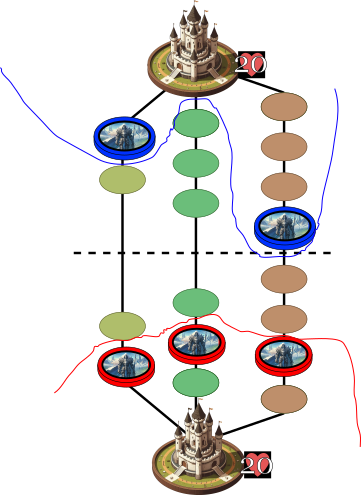

Each side has a total of 9 space available, and the board has max 18 space total.

Some cards have an additional condition, where they can only be played when the controlled space is more, less, or between a certain range:

This can be used to balance cards and their cost, for example: 

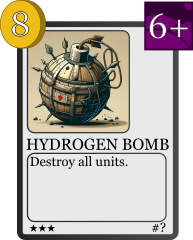

This (probably still broken) card can only be played if you yourself also have enough space, meaning that you'd lose units too and not only the enemy. 

## Tags

Cards can have tags.
Although the base cards don't have tags, they can be useful to design cards that interact with each other, for example:

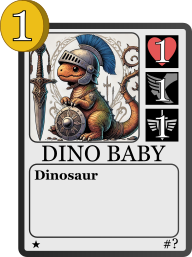

Although useless by itself, then it can interact with cards with effects like "draw a dinosaur from your deck", or stuff like that.