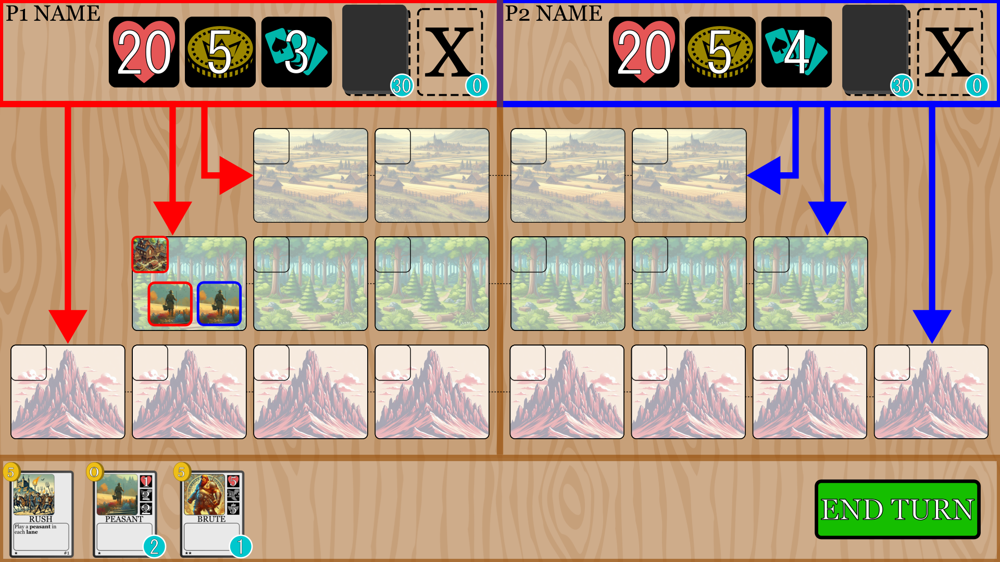
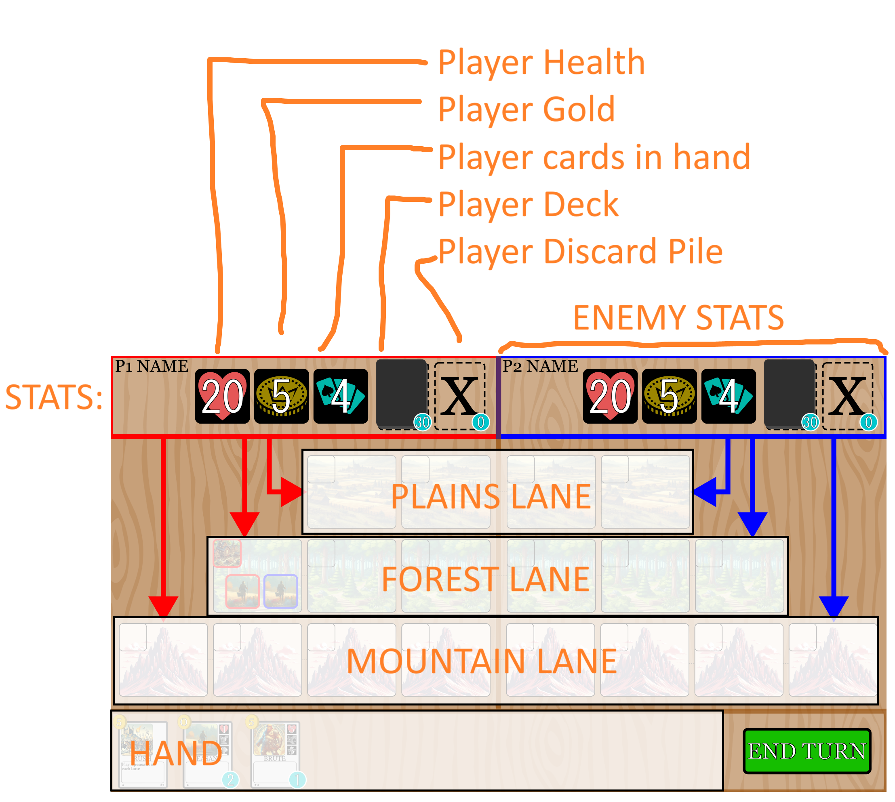
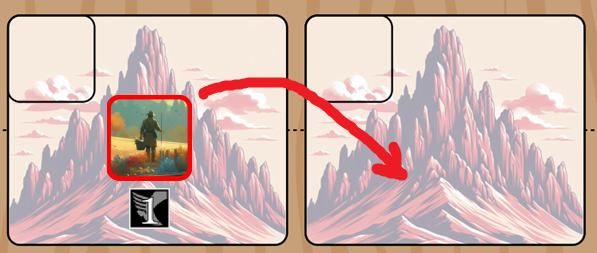
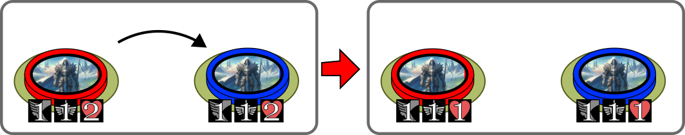
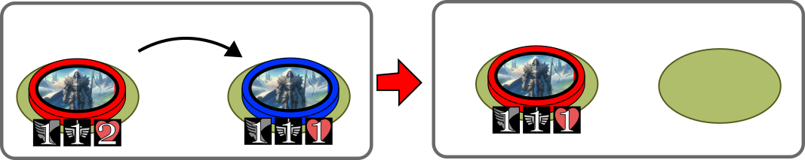
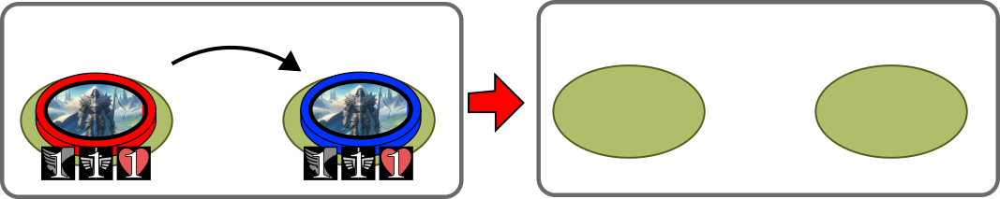
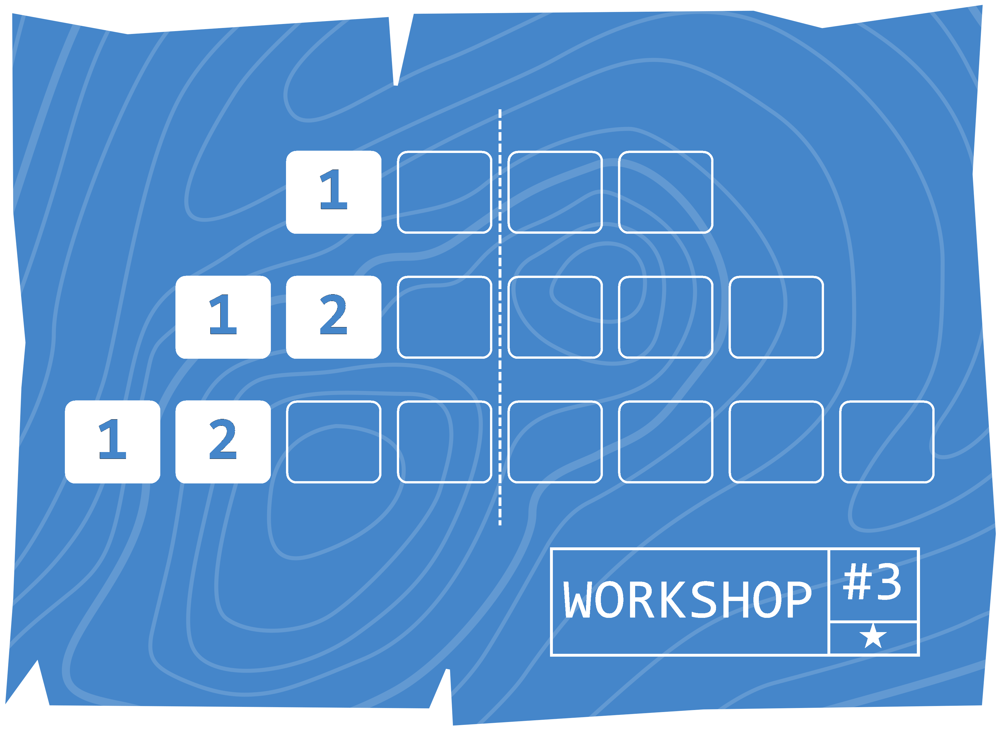
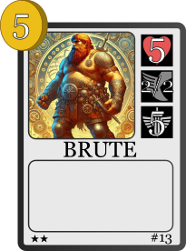

# Concept

This is a battle between two armies. Each player has **20 health points (HP)**.
The player who reaches 0HP loses the game.

Players take turn, playing **Units**, **Skills** and **Buildings** to try and defeat their opponent.

There are 3 **lanes** a player can take to their enemies territory:
The **plains**, the **forest** and the **mountains**.
Each lane is comprised of a number of **tiles**:
- **Plains**: 4 tiles
- **Forest**: 6 tiles
- **Mountains**: 8 tiles 

Players have **gold** as a resource, which they use to play cards.
Players start the game with 5 gold each.

In their turn, players can choose to:
- Play a card (from their hand). The card is discarded and goes to the discard pile after playing. Cards are played by paying their gold cost 
- Use an active ability ( **CONSCRIPTION** by default, explained below)
- End their turn

# Units

The units stats are:
-  **HP:** Damage that the unit can take. When it reaches 0, unit dies.
-  **Movement:** How many **tiles** the unit will advance when **marching (explained below)**.
-  **Attack:** Damage that the unit does to enemies.

When a unit card is played, the player chooses in which **lane** to place it (either **plains**, **forest** or **mountains**).
Unit is then placed on the first square of that **lane**.

# March

Units can **march**.
When **marching**, a unit will advance forward to the next **tile**, as many times as their their respective **movement** stat.

If a unit shares the **tile** with an enemy unit, the advancing unit will stop their march and will attack them instead.
Both units will receive HP damage "simultaneously" depending on the enemies attack.

- When a **combat** between units occur, the unit finishes their **march**, regardless of outcome of battle and the movement stat of the unit.
- If unit is in the last **tile** of a **lane** it will instead damage the opposing player when advancing. Unit won't **march** further or attack multiple times, regardless of the **movement** stat.
- If multiple defending units are in a **tile**, the first unit spawned is the one targeted for the attack.
- For most purposes, units are damaged simultaneously, and may even die at the same time.

# Skills

A type of card that has an effect when played.

These can be added into the deck, but all players of all **classes** also have an **Active Skill** available for them each turn.

Most classess can use the **CONSCRIPTION** skill, as as an active skill, which summons a **MILITIA** unit in every lane.
**Active Skills** can be used every turn (if the player can afford it), once per turn.
Other skill cards can be added to a player's deck and used.

# Buildings

Buildings are similar to units, as they are entities that appear in the board when their respective card is played.
Buildings need to be **constructed** by a unit.
For this purpose they contain a blueprint, which specifies in where it can be built.
When a building's lane is chosen, it is built in the first available tile.

- Once built, the building remains in that **tile** until destroyed
- Units will **enter** the building when they arrive to the tile where the building is located
- Units already in the tile when a building is **constructed** will NOT **enter** the building
- When an enemy unit **enters** a building, it will damage the building by it's **attack** stat, but can continue their **march** as normal
- To **construct** a building, an unit needs to be present on at least one of the **tiles** indicated in the blueprint
- Only one building can be placed in a specific **tile**, a building can't be constructed if another building is present in the **tile**

# Classes

Each player will play a game with a specific chosen **class** (e.g. warrior, mage, astronauts, dinosaurs, whatever).
Each **class** will have different cards and different game styles.
However, all classes can also also cards from the **Base Set**.

- When building a deck, a player has to choose a class, build a deck with a total of exactly 30 cards. They can use cards from both their specific **Class Cards** and the **Base Set** cards.
- Card with **rarity** 1★, 2★ and 3★ can only have 3, 2, 1 copies in a deck respectively
- Cards with **rarity** 0★ can't be put in a deck. They consist of cards that are auto-generated by other cards effects
- Some classes may also have a **Passive Skill** that change how the game is played for them

# Game Structure

When the game begins:
- Each player starts with 4 cards in their hand, and 5 **gold**

Each turn there's the following phases:
- Beggining of turn:
    - First, all of the player's units **march**, in order that they were played
    - Player then draws a card
    - Also, the player player gets 2 **gold**
- Play phase: Player can use their resources to play cards or the **Active Skill** (only once per turn)
- End of turn: Player ends their turn
- Beginning of turn for the next player

Game continues until one player loses

- If a player runs out of cards in their deck, the player loses 5 **HP** at the beginning of each turn.

# Complex Rules
## Fractional Movement

A unit can have its **movement** expressed in a fraction (e.g. X/Y).
This means that the unit will advance X spaces every Y turns (i.e. waits a number of turns until it can move again).
This creates slow units.

# Keyword Glossary

- **Active Skill**, a skill card that is always available to be played by any player once per turn. Different classes *may* have different **active skills**
- **Attack**, the attack stat of a unit, affects how much damage it will deal to other units in **combat** or to buildings when **entering** 
- **Base Set** a basic set of medieval-themed cards available to any **Class** to put in their deck
- **Class**, a class of a player. Each class has their own specific **Class Cards**
- **Class Cards** are a type of card that can only be used by a specific **Class**
- **Combat**, happens between units. Each unit deals **HP** damage to the other unit equal to their **attack**. Combat happens simultaneously
- **Construction**, when a unit builds a building
- **Enter**, an action that a unit does when it arrives to a tile when a building is located. The unit will **enter** the building. Enemy units will also deal damage to the building
- **Forest**, a **lane** 6 **tiles** long
- **Gold**, the main resource of the game, used to pay for cards costs 
- **HP**, Health Points of a Unit, Building, or Player 
- **Lane**, Locations on the board. There's three lanes, the **Forest**, **Mountains** and **Plains**
- **March**, action that units do, where they advance a specific number of **tiles**, **combat** may be initiated, and the unit may **enter** buildings in a lane
- **Mountains**, a **lane** 8 **tiles** long
- **Movement**, a stat. Determines how many tiles will a unit addvance when **marching** 
- **Passive Skill**, an ongoing effect that may change/add game mechanics. Classes *may* have **passive skills**
- **Plains**, a **lane** 4 **tiles** long
- **Rarity** a property of a card. Is measured in number of stars ★ and affects how many copies of this card can be put in a deck
- **Tile**, a location in the board, it's a square where units and buildings are placed. Each lane has a fixed number of tiles